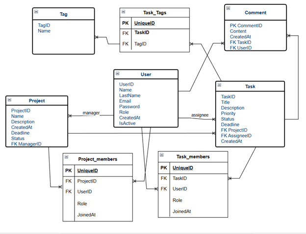

Звіт з лабораторної роботи: Проєктування бази даних управління проєктами

1. Короткий виклад вимог
* Замовник потребує надійної системи для управління проєктами, яка забезпечує цілісність даних та історію дій.
* Система повинна унеможливлювати дублювання даних та випадкову втрату історії при звільненні співробітників.

Основні бізнес-правила
Ієрархія: Кожне завдання належить до одного проєкту.
Сувора відповідальність: Завдання повинно мати одного відповідального виконавця (`AssigneeID`), поле є обов'язковим (`NOT NULL`).
Унікальність участі: Система повинна технічно блокувати спроби додати одного користувача в команду завдання чи проєкту двічі (Unique Constraint на пари ID).
Збереження історії (Soft Delete): Користувачів не можна видаляти фізично з бази, якщо вони мають пов'язані завдання.Замість цього використовується деактивація.
Захист даних: Видалення активного менеджера або виконавця повинно бути заборонено на рівні бази даних (`ON DELETE RESTRICT`).

2. Діаграма ER 

3. Детальний опис сутностей та атрибутів

4. Основні сутності
User (Користувач):
  * `UserID` (PK): Унікальний ідентифікатор.
  * `Name`, `LastName`: Особисті дані.
  * `Email`: Логін.
  * `Password` (String, hashed): Хеш пароля користувача.
  * `Role`: Рівень доступу.
  * `CreatedAt`: Дата реєстрації.
  * `IsActive` (Boolean): Прапорець статусу (Active/Inactive).

* Project (Проєкт):
  * `ProjectID` (PK): Унікальний ідентифікатор.
  * `Name`, `Description`: Опис проєкту.
  * `CreatedAt`, `Deadline`, `Status`: Параметри часу та стану.
  * `ManagerID` (FK): Власник проєкту (`NOT NULL`).
  *  Обмеження: `ON DELETE RESTRICT` (Не можна видалити юзера, доки він є менеджером активного проєкту).

* Task (Завдання):
  * `TaskID` (PK): Унікальний ідентифікатор.
  * `Title`, `Priority`, `Status`, `Description`: Параметри завдання.
  * `CreatedAt`, `Deadline`: Часові рамки.
  * `ProjectID` (FK): Прив'язка до проєкту.
  * `AssigneeID` (FK): Відповідальний виконавець (`NOT NULL`).
  * Обмеження: `ON DELETE RESTRICT` (Не можна видалити юзера, якщо на ньому висять завдання).

* Tag (Тег):
  * `TagID` (PK), `Name`: Довідник міток.

* Comment (Коментар):
  * `CommentID` (PK), `Content`: Зміст.
  * `CreatedAt`: Час створення.
  * `TaskID` (FK), `UserID` (FK): Прив'язка до контексту.

Асоціативні сутності (Junction Tables) з обмеженнями 
* Task_Tags (Теги завдання)]:
  * `UniqueID` (PK): Сурогатний ключ запису.
  * `TaskID` (FK): Посилання на завдання.
  * `TagID` (FK): Посилання на тег.
  * `Unique Constraint` (`TaskID`, `TagID`): Композитне обмеження, що запобігає дублюванню того самого тегу в одному завданні.

* Project_Members (Команда проєкту):
  * `UniqueID` (PK): Сурогатний ключ.
  * `ProjectID` (FK): Посилання на проєкт.
  * `UserID` (FK): Посилання на учасника.
  * `Role`: Роль у проєкті.
  * `JoinedAt` (DateTime): Дата та час приєднання до команди (для аудиту).
  * `Unique Constraint` (`ProjectID`, `UserID`): Запобігає дублюванню.

* Task_Members (Співвиконавці завдання):
  * `UniqueID` (PK): Сурогатний ключ.
  * `TaskID` (FK): Посилання на завдання.
  * `UserID` (FK): Посилання на співвиконавця.
  * `Role`: Роль (наприклад, 'Reviewer').
  * `JoinedAt` (DateTime): Дата залучення до завдання.
  * `Unique Constraint` (`TaskID`, `UserID`): Запобігає дублюванню співробітника в списку співвиконавців.

4. Припущення та обмеження цілісності
При проєктуванні були прийняті наступні рішення для забезпечення стабільності бази даних:
* Стратегія видалення користувачів: Оскільки поле `AssigneeID` у таблиці `Task` є `NOT NULL`, фізичне видалення користувача призвело б до помилки цілісності даних.
* Тому впроваджено механізм Soft Delete: користувачу встановлюється статус `IsActive = FALSE`.
* Він втрачає доступ до системи, але його ім'я залишається в історії виконаних завдань та коментарях.
* Спроба фізичного видалення (`DELETE FROM User`) буде заблокована базою даних (`ON DELETE RESTRICT`), якщо у користувача є активні зв'язки.
* Унікальність зв'язків: У всіх таблицях зв'язків (`Task_Tags`, `Project_Members`, `Task_Members`) використовуються композитні унікальні ключі. Це гарантує логічну коректність даних (M:N) і унеможливлює технічні помилки дублювання записів[cite: 68].
* Аудит участі: Поля `JoinedAt` у таблицях учасників дозволяють відстежувати хронологію змін у командах проєктів та завдань.