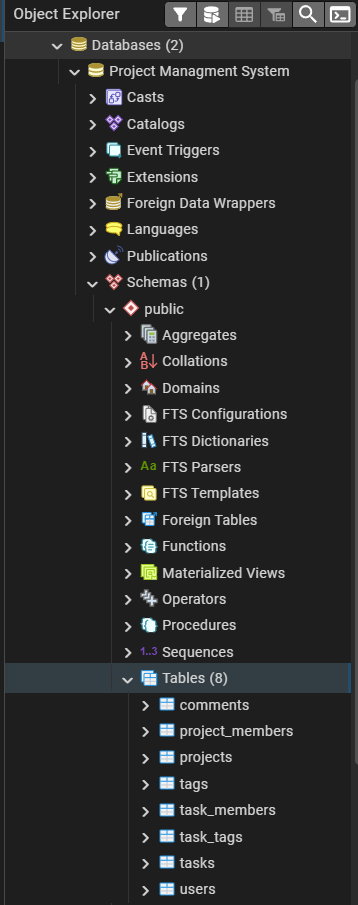
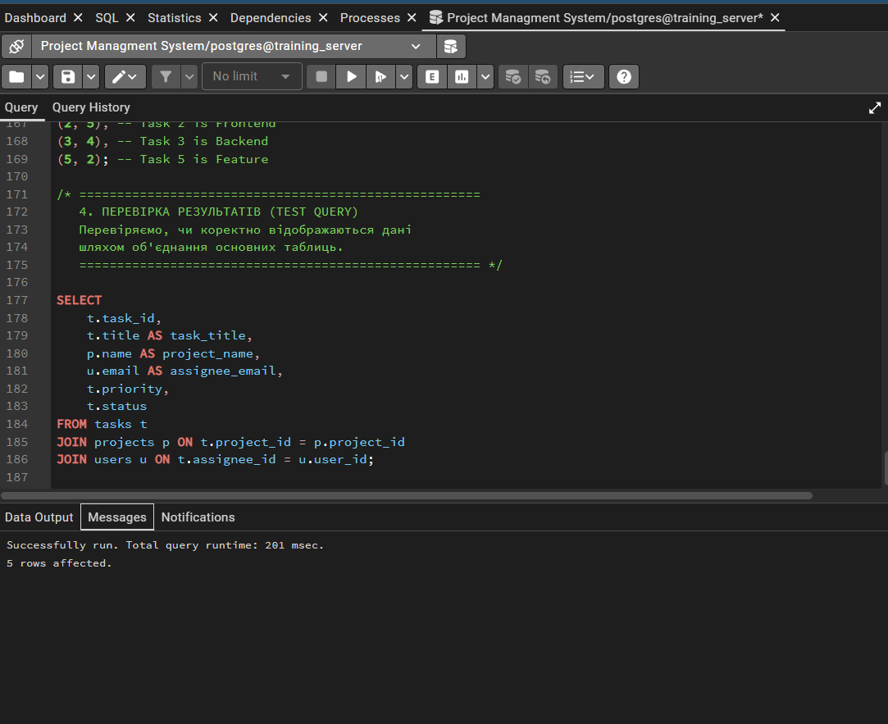
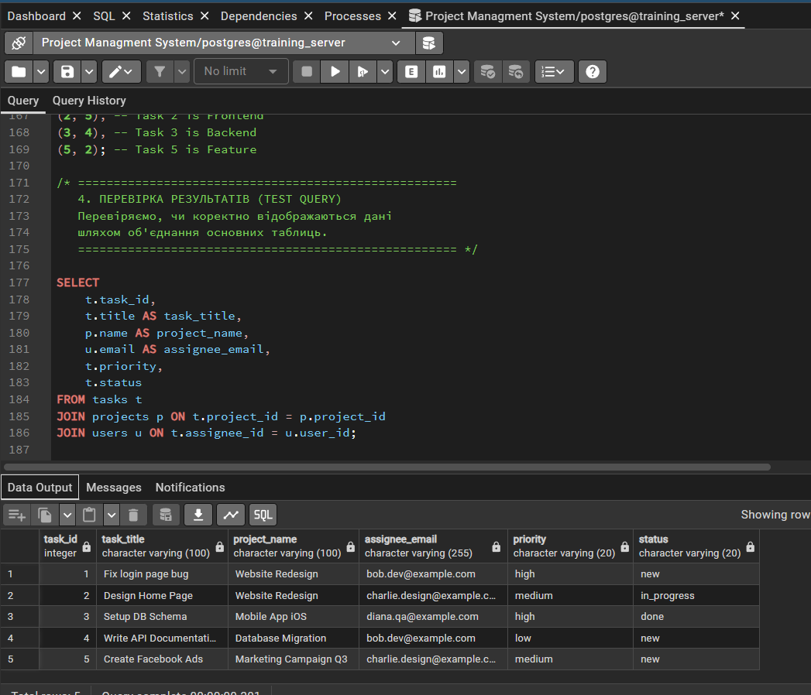

# Звіт з Лабораторної роботи №2

---

## 1. Опис фінальної схеми бази даних (Task Management System)

Схема бази даних розроблена на основі попередньо створеної ER-діаграми та складається з 8 таблиць. Усі таблиці мають сурогатні первинні ключі (`SERIAL PRIMARY KEY`).

### Основні таблиці
* **`users` (Користувачі)**
  * **Стовпці:** `user_id` (PK), `first_name`, `last_name`, `email`, `password_hash`, `role`, `created_at`, `is_active`.
  * **Обмеження:** `email` є `UNIQUE NOT NULL`. Поле `role` має обмеження `CHECK (role IN ('admin', 'user'))`. Застосовано концепцію "Soft Delete" (поле `is_active`).
* **`tags` (Теги)**
  * **Стовпці:** `tag_id` (PK), `name`.
  * **Обмеження:** `name` є `UNIQUE` (назви тегів не можуть дублюватися).
* **`projects` (Проєкти)**
  * **Стовпці:** `project_id` (PK), `name`, `description`, `status`, `created_at`, `deadline`, `manager_id`.
  * **Зовнішні ключі:** `manager_id` (FK) посилається на `users(user_id)`.
  * **Припущення:** Встановлено `ON DELETE RESTRICT`, щоб запобігти видаленню користувача, якщо він є менеджером проєкту.
* **`tasks` (Завдання)**
  * **Стовпці:** `task_id` (PK), `title`, `description`, `priority`, `status`, `created_at`, `deadline`, `project_id`, `assignee_id`.
  * **Обмеження:** `priority` має обмеження `CHECK (priority IN ('low', 'medium', 'high'))`.
  * **Зовнішні ключі:** `project_id` (FK -> `projects`), `assignee_id` (FK -> `users`). При видаленні проєкту всі його завдання видаляються автоматично (`ON DELETE CASCADE`).
* **`comments` (Коментарі)**
  * **Стовпці:** `comment_id` (PK), `content`, `created_at`, `user_id`, `task_id`.
  * **Зовнішні ключі:** Посилаються на `users` (`RESTRICT`) та `tasks` (`CASCADE`).

### Асоціативні таблиці (M:N)
* **`project_members`**, **`task_members`**, **`task_tags`**
  * Усі три таблиці мають сурогатний `unique_id` (PK) та по два зовнішні ключі на відповідні таблиці з правилом `ON DELETE CASCADE`.
  * **Важливе обмеження:** Для кожної таблиці створено композитне обмеження `UNIQUE (id_1, id_2)`, щоб запобігти дублюванню записів (наприклад, щоб один юзер не міг бути доданий у проєкт двічі).

---

## 2. SQL-скрипт (DDL та DML)

Нижче наведено повний скрипт, який створює таблиці та наповнює кожну з них тестовими даними (мінімум по 5 рядків).

```sql
/* === 1. ОЧИЩЕННЯ БД (DROP) === */
DROP TABLE IF EXISTS task_tags;
DROP TABLE IF EXISTS task_members;
DROP TABLE IF EXISTS project_members;
DROP TABLE IF EXISTS "comments";
DROP TABLE IF EXISTS tasks;
DROP TABLE IF EXISTS projects;
DROP TABLE IF EXISTS tags;
DROP TABLE IF EXISTS users;

/* === 2. СТВОРЕННЯ ТАБЛИЦЬ (DDL) === */

CREATE TABLE users (
    user_id SERIAL PRIMARY KEY,
    first_name VARCHAR(100) NOT NULL,
    last_name VARCHAR(100) NOT NULL,
    email VARCHAR(255) UNIQUE NOT NULL,
    password_hash VARCHAR(255) NOT NULL,
    role VARCHAR(32) NOT NULL CHECK (role IN ('admin', 'user')),
    created_at TIMESTAMP DEFAULT CURRENT_TIMESTAMP,
    is_active BOOLEAN DEFAULT TRUE NOT NULL
);

CREATE TABLE tags (
    tag_id SERIAL PRIMARY KEY,
    name VARCHAR(50) UNIQUE NOT NULL
);

CREATE TABLE projects (
    project_id SERIAL PRIMARY KEY,
    name VARCHAR(100) NOT NULL,
    description TEXT,
    status VARCHAR(32) NOT NULL DEFAULT 'active',
    created_at TIMESTAMP DEFAULT CURRENT_TIMESTAMP,
    deadline TIMESTAMP,
    manager_id INTEGER NOT NULL REFERENCES users(user_id) ON DELETE RESTRICT
);

CREATE TABLE tasks (
    task_id SERIAL PRIMARY KEY,
    title VARCHAR(100) NOT NULL,
    description TEXT,
    priority VARCHAR(20) NOT NULL CHECK (priority IN ('low', 'medium', 'high')),
    status VARCHAR(20) NOT NULL DEFAULT 'new',
    created_at TIMESTAMP DEFAULT CURRENT_TIMESTAMP,
    deadline TIMESTAMP,
    project_id INTEGER NOT NULL REFERENCES projects(project_id) ON DELETE CASCADE,
    assignee_id INTEGER NOT NULL REFERENCES users(user_id) ON DELETE RESTRICT
);

CREATE TABLE "comments" (
    comment_id SERIAL PRIMARY KEY,
    content TEXT NOT NULL,
    created_at TIMESTAMP DEFAULT CURRENT_TIMESTAMP,
    user_id INTEGER NOT NULL REFERENCES users(user_id) ON DELETE RESTRICT,
    task_id INTEGER NOT NULL REFERENCES tasks(task_id) ON DELETE CASCADE
);

CREATE TABLE project_members (
    unique_id SERIAL PRIMARY KEY,
    project_id INTEGER NOT NULL REFERENCES projects(project_id) ON DELETE CASCADE,
    user_id INTEGER NOT NULL REFERENCES users(user_id) ON DELETE CASCADE,
    role VARCHAR(32) NOT NULL,
    joined_at TIMESTAMP DEFAULT CURRENT_TIMESTAMP,
    CONSTRAINT unique_project_member UNIQUE (project_id, user_id)
);

CREATE TABLE task_members (
    unique_id SERIAL PRIMARY KEY,
    task_id INTEGER NOT NULL REFERENCES tasks(task_id) ON DELETE CASCADE,
    user_id INTEGER NOT NULL REFERENCES users(user_id) ON DELETE CASCADE,
    role VARCHAR(32) NOT NULL,
    joined_at TIMESTAMP DEFAULT CURRENT_TIMESTAMP,
    CONSTRAINT unique_task_member UNIQUE (task_id, user_id)
);

CREATE TABLE task_tags (
    unique_id SERIAL PRIMARY KEY,
    task_id INTEGER NOT NULL REFERENCES tasks(task_id) ON DELETE CASCADE,
    tag_id INTEGER NOT NULL REFERENCES tags(tag_id) ON DELETE CASCADE,
    CONSTRAINT unique_task_tag UNIQUE (task_id, tag_id)
);

/* === 3. НАПОВНЕННЯ ДАНИМИ (DML / INSERT) === */

INSERT INTO users (first_name, last_name, email, password_hash, role) VALUES
('Alice', 'Smith', 'alice.admin@example.com', 'hashed_secret_001', 'admin'),
('Bob', 'Johnson', 'bob.dev@example.com', 'hashed_secret_002', 'user'),
('Charlie', 'Williams', 'charlie.design@example.com', 'hashed_secret_003', 'user'),
('Diana', 'Brown', 'diana.qa@example.com', 'hashed_secret_004', 'user'),
('Evan', 'Jones', 'evan.manager@example.com', 'hashed_secret_005', 'user');

INSERT INTO tags (name) VALUES
('Bug'), ('Feature'), ('Urgent'), ('Backend'), ('Frontend');

INSERT INTO projects (name, description, status, manager_id, deadline) VALUES
('Website Redesign', 'Complete overhaul of the corporate website.', 'active', 1, '2024-12-31 23:59:59'),
('Mobile App iOS', 'Native iOS application development.', 'active', 2, '2024-10-15 18:00:00'),
('Database Migration', 'Migrating from MySQL to PostgreSQL.', 'active', 5, '2024-06-01 09:00:00'),
('Internal HR Tool', 'System for managing employee vacations.', 'completed', 3, '2023-12-25 12:00:00'),
('Marketing Campaign Q3', 'Social media integration and ads.', 'active', 1, '2024-09-01 10:00:00');

INSERT INTO tasks (title, description, priority, status, project_id, assignee_id, deadline) VALUES
('Fix login page bug', 'Users cannot reset password via email.', 'high', 'new', 1, 2, '2024-08-20 14:00:00'),
('Design Home Page', 'Create Figma mockups for the main page.', 'medium', 'in_progress', 1, 3, '2024-08-25 18:00:00'),
('Setup DB Schema', 'Create initial tables for the app.', 'high', 'done', 2, 4, '2024-05-10 12:00:00'),
('Write API Documentation', 'Document all endpoints in Swagger.', 'low', 'new', 3, 2, '2024-06-05 16:00:00'),
('Create Facebook Ads', 'Design banners for the campaign.', 'medium', 'new', 5, 3, '2024-08-30 11:00:00');

INSERT INTO "comments" (content, user_id, task_id) VALUES
('I cannot reproduce this bug locally.', 2, 1),
('Please check the latest designs in Figma.', 3, 2),
('Great job, the schema looks solid.', 1, 3),
('Do we need to document internal APIs too?', 4, 4),
('I will start working on this tomorrow.', 3, 5);

INSERT INTO project_members (project_id, user_id, role) VALUES
(1, 2, 'Developer'),
(1, 3, 'Designer'),
(2, 4, 'QA Engineer'),
(2, 5, 'DevOps'),
(3, 2, 'Backend Dev');

INSERT INTO task_members (task_id, user_id, role) VALUES
(1, 4, 'Tester'),
(2, 1, 'Reviewer'),
(3, 5, 'Consultant'),
(4, 3, 'Editor'),
(1, 5, 'Support');

INSERT INTO task_tags (task_id, tag_id) VALUES
(1, 1), 
(1, 3), 
(2, 5), 
(3, 4), 
(5, 2); 

/* === 4. ПЕРЕВІРКА РЕЗУЛЬТАТІВ (TEST QUERY) === */
SELECT 
    t.task_id,
    t.title AS task_title,
    p.name AS project_name,
    u.email AS assignee_email,
    t.priority,
    t.status
FROM tasks t
JOIN projects p ON t.project_id = p.project_id
JOIN users u ON t.assignee_id = u.user_id;
```


## 3. Результати виконання та докази наповнення даними

Нижче наведено скріншоти з pgAdmin, які підтверджують успішне створення таблиць та наповнення їх тестовими даними.

**Рис. 1. Створені таблиці в pgAdmin (Object Explorer)** 

**Рис. 2. Успішне виконання запитів DDL та DML (Вкладка Messages)** 

**Рис. 3. Результат вибірки даних (Перевірка зв'язків через SELECT)** 