# Лабораторна робота №3

## Маніпулювання даними SQL (OLTP)

---

### Роботу виконав

Студент КПІ, групи ІО-46
Орєшин Денис

### Роботу перевірив

Русінов В.В.

---

## Мета роботи

Ознайомитися з операціями маніпулювання даними в PostgreSQL та набути практичних навичок використання SQL-запитів типу SELECT, INSERT, UPDATE і DELETE для роботи з базою даних у режимі OLTP.

---

## Цілі

* Написати запити SELECT для отримання даних (включаючи фільтрацію за допомогою WHERE та вибір певних стовпців).
* Практикувати використання операторів INSERT для додавання нових рядків до таблиць.
* Практикувати використання оператора UPDATE для зміни існуючих рядків (використовуючи SET та WHERE).
* Практикувати використання операторів DELETE для безпечного видалення рядків (за допомогою WHERE).
* Вивчити основні операції маніпулювання даними (DML) у PostgreSQL та спостерігати за їхнім впливом.

---

## Хід роботи

### 1. Отримання даних (SELECT)

Було виконано запити для отримання даних з таблиць бази даних.

```sql
-- SELECT
-- 1. Пошук усіх невиконаних завдань з високим пріоритетом
SELECT task_id, title, status, deadline 
FROM tasks 
WHERE priority = 'high' AND status != 'done';
```
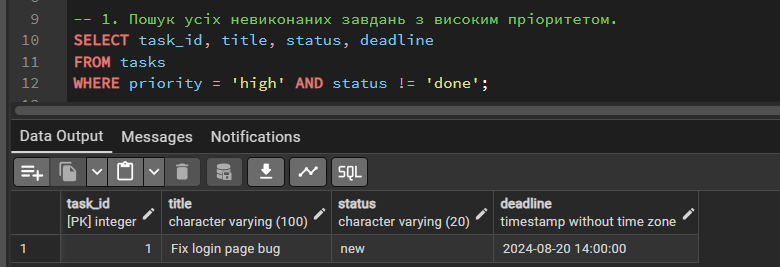
```sql
-- 2. Пошук усіх активних співробітників
SELECT user_id, first_name, last_name, email 
FROM users 
WHERE is_active = TRUE;
```
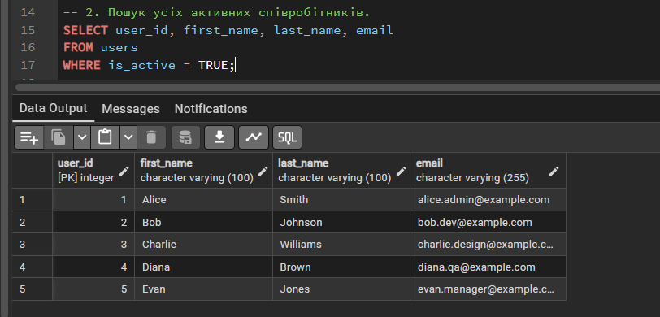
```sql
-- 3. Вибірка всіх коментарів до конкретного завдання (task_id = 3)
SELECT comment_id, content, created_at 
FROM "comments" 
WHERE task_id = 3;
```
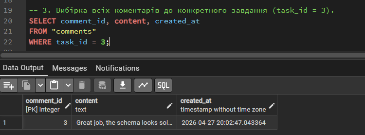
```sql
-- 4. Пошук активних проєктів, у яких дедлайн закінчується 
SELECT project_id, name, status, deadline 
FROM projects 
WHERE deadline < '2025-01-01 00:00:00' AND status = 'active';
```
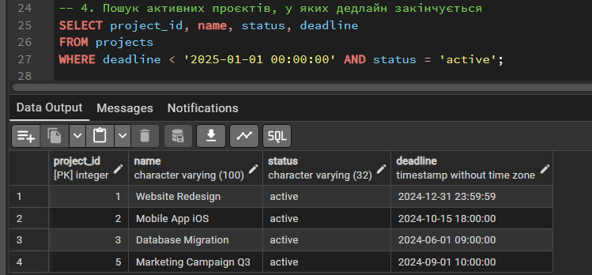
### 2. Додавання даних (INSERT)
Було додано нові записи до таблиць бази даних за допомогою оператора INSERT.
```sql
-- INSERT
-- 1. Додавання нового співробітника (QA Engineer)
INSERT INTO users (first_name, last_name, email, password_hash, role) 
VALUES ('Oleh', 'Petrenko', 'oleh.qa@example.com', 'hash_secure_999', 'user');
```
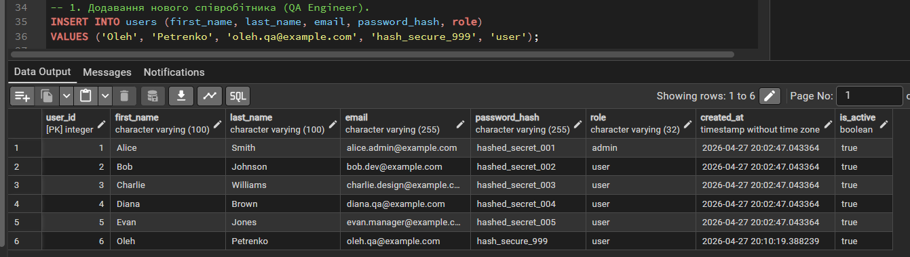
```sql
-- 2. Створення термінового багу (призначаємо на розробника з user_id = 2).
INSERT INTO tasks (title, description, priority, status, project_id, assignee_id, deadline) 
VALUES ('Критична помилка оплати', 'Клієнти не можуть провести оплату', 'high', 'new', 1, 2, '2024-05-01 12:00:00');
```
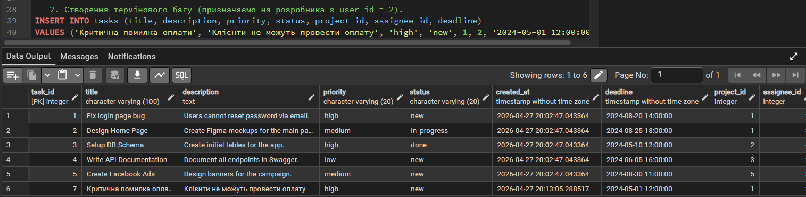
```sql
-- 3. Додавання нового тегу для позначення критичних виправлень.
INSERT INTO tags (name) 
VALUES ('Hotfix');
```
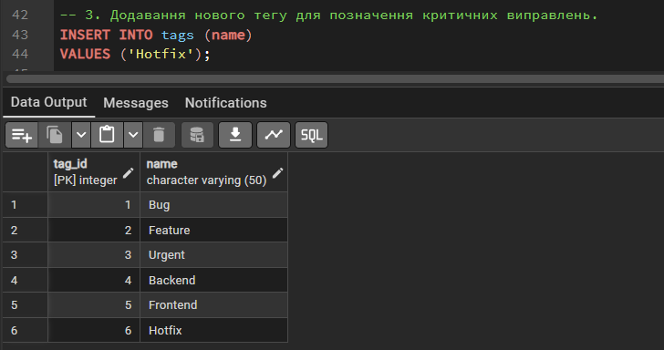
```sql
-- 4. Створення нового внутрішнього проєкту для аналітики.
INSERT INTO projects (name, description, status, manager_id, deadline) 
VALUES ('Internal Analytics', 'Збір метрик використання системи', 'active', 1, '2024-11-01 10:00:00');
```
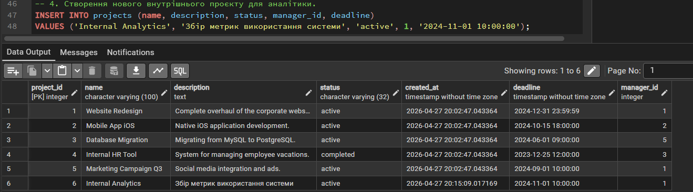
### 3. Оновлення даних (UPDATE)
Було виконано оновлення існуючих записів у таблицях бази даних за допомогою оператора UPDATE із використанням умов WHERE.

```sql
-- UPDATE
-- 1. Розробник бере задачу в роботу
UPDATE tasks 
SET status = 'in_progress' 
WHERE task_id = 7;
```
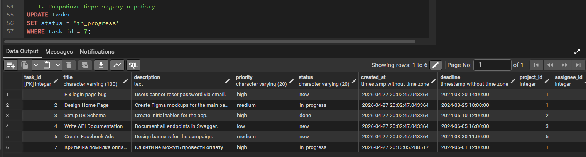
```sql
-- 2. Менеджер змінює дедлайн для завдання (task_id = 2).
UPDATE tasks 
SET deadline = '2024-09-01 18:00:00' 
WHERE task_id = 2;
```
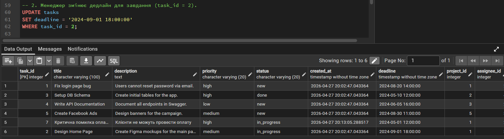
```sql
-- 3. Оновлення статусу проєкту на "завершений" (project_id = 4).
UPDATE projects 
SET status = 'completed' 
WHERE project_id = 4;
```
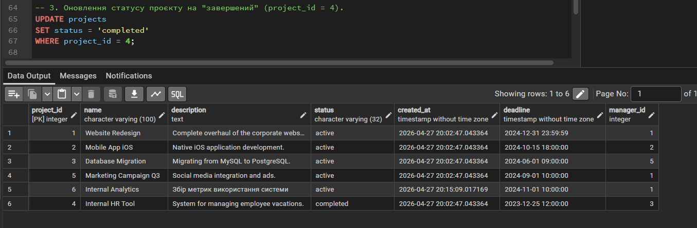
```sql
-- 4. Зміна ролі користувача при призначенні адміністратором.
UPDATE users 
SET role = 'admin' 
WHERE email = 'bob.dev@example.com';
```
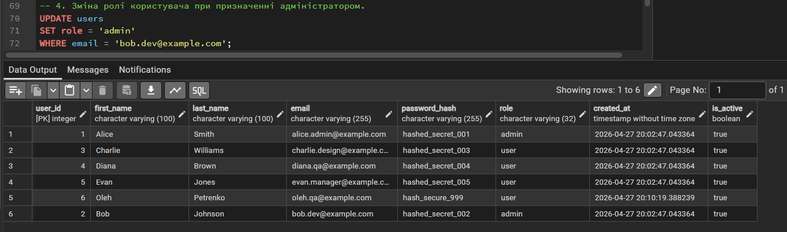
### 4. Видалення даних (DELETE)
Було виконано видалення записів із таблиць бази даних за допомогою оператора DELETE із використанням умов WHERE 
(або логічне видалення через UPDATE, згідно з бізнес-правилами).
```sql
-- 1. Видалення коментаря, що містить некоректну інформацію (comment_id = 1).
DELETE FROM "comments" 
WHERE comment_id = 1;
```
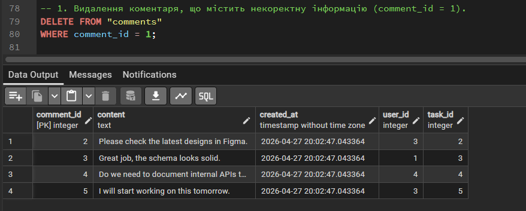
```sql
-- 2. Логічне видалення (Soft Delete) співробітника, який звільнився.
UPDATE users 
SET is_active = FALSE 
WHERE email = 'charlie.design@example.com';
```
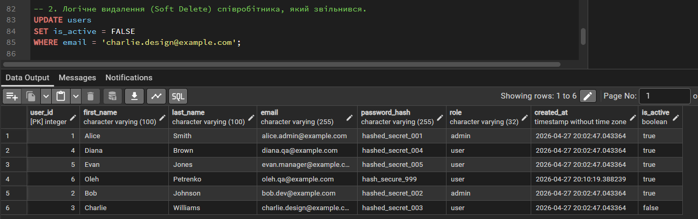
```sql
-- 3. Видалення помилково призначеного тегу із завдання (task_id = 1, tag_id = 1).
DELETE FROM task_tags 
WHERE task_id = 1 AND tag_id = 1;
```
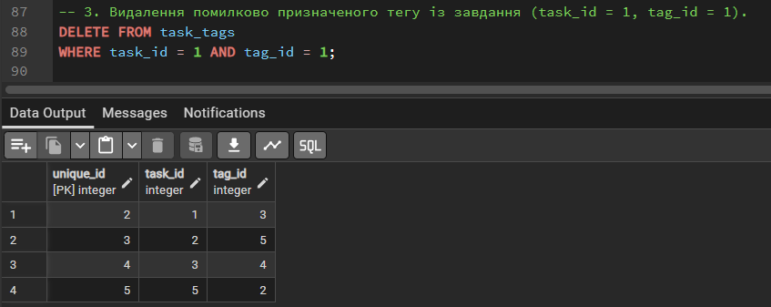
```sql
-- 4. Видалення неактуального тегу, який більше не використовується.
DELETE FROM tags 
WHERE name = 'Hotfix';
```
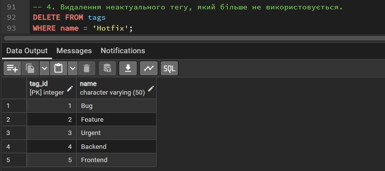

### Результати
У ході виконання лабораторної роботи було виконано SQL-запити для отримання, додавання, оновлення та видалення даних у
базі даних системи управління проєктами. Було перевірено коректність виконання кожної операції за допомогою 
SELECT-запитів. Отримані результати підтверджують правильність роботи з базою даних та дотримання обмежень цілісності.


### Висновок
У ході виконання лабораторної роботи  навчився працювати з операторами маніпулювання даними в PostgreSQL.
Виконав запити SELECT, INSERT, UPDATE та DELETE, а також перевірив їхню роботу на практиці. 
У результаті зрозумів принципи роботи OLTP-запитів, реалізував конкретні бізнес-сценарії 
(наприклад, додавання термінових багів та Soft Delete для користувачів) і навчився безпечно змінювати дані 
в таблицях за допомогою фільтрації WHERE. Це дозволило переконатися у надійності спроєктованої архітектури бази даних.
