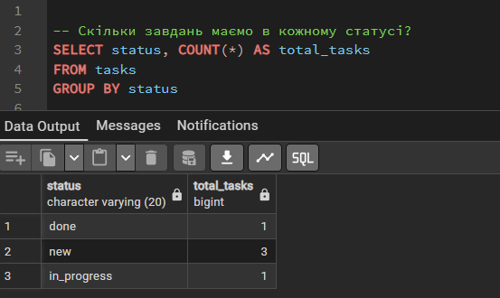
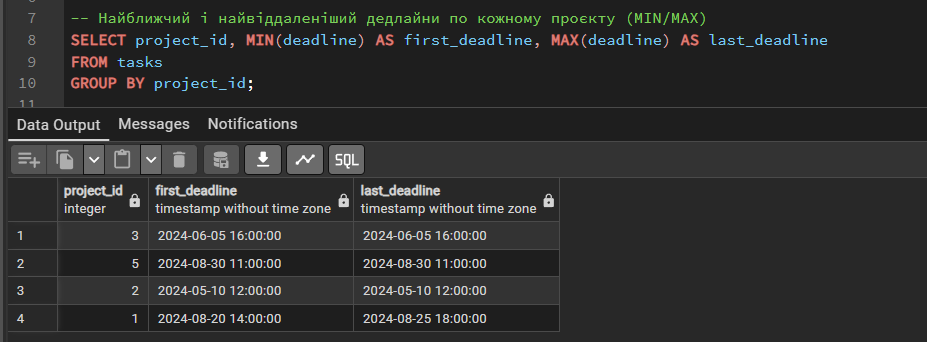
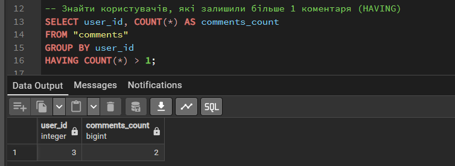
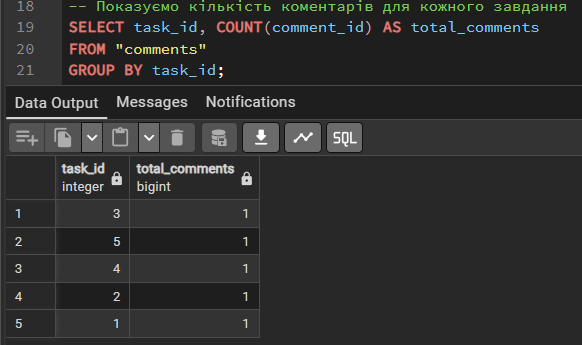
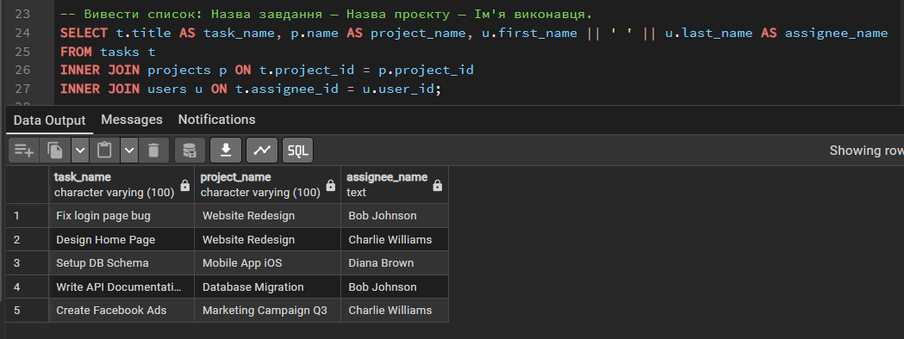
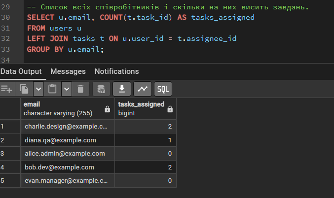
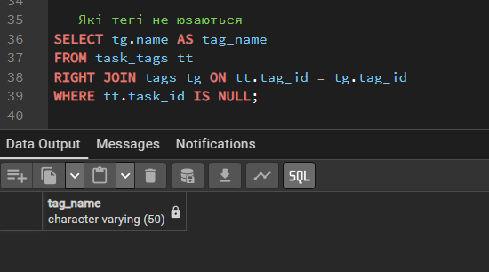
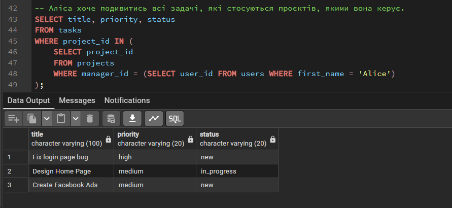
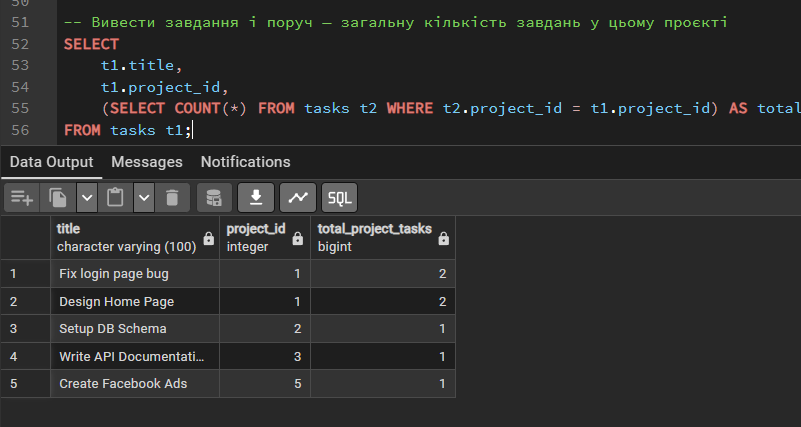
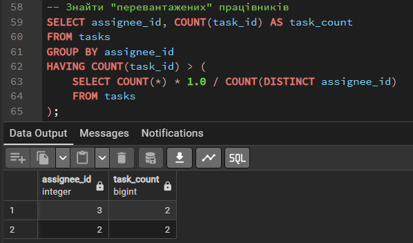

# Лабораторна робота №4

## Аналітичні SQL-запити (OLAP)
---

### Роботу виконали

Студент групи ІО-46
Орєшин Д.І.

### Роботу перевірив

Русінов В.В.

---

## Мета роботи

Ознайомлення з аналітичними SQL-запитами (OLAP), використання агрегатних функцій, групування даних, об'єднання таблиць (JOIN) та підзапитів для отримання узагальненої інформації з бази даних.

---

## Цілі

* Використовувати агрегатні функції, такі як COUNT, SUM, AVG, MIN та MAX, для обчислення зведеної статистики з ваших даних.
* Написати запити GROUP BY для групування рядків за одним або кількома стовпцями та обчислення агрегатів для кожної групи.
* Використовувати HAVING для фільтрації результатів згрупованих запитів на основі агрегованих умов.
* Виконувати операції JOIN (принаймні INNER JOIN та LEFT JOIN), щоб об'єднати дані з кількох таблиць.
* Створювати об'єднані запити на агрегацію для кількох таблиць, які об'єднують таблиці та створюють згрупований, агрегований вивід.
* Інтерпретувати результати ваших запитів та пояснити, що робить кожен з них.

---

## Хід роботи

### 1. Запити з агрегатними функціями 

```sql
-- Скільки завдань маємо в кожному статусі?
SELECT status, COUNT(*) AS total_tasks
FROM tasks
GROUP BY status
```


Запит групує всі завдання за їхнім статусом і підраховує кількість завдань у кожній групі. Це дає базове розуміння навантаження та прогресу.

--- 

```sql
-- Найближчий і найвіддаленіший дедлайни по кожному проєкту (MIN/MAX)
SELECT project_id, MIN(deadline) AS first_deadline, MAX(deadline) AS last_deadline
FROM tasks
GROUP BY project_id;
```


Запит показує часові рамки для кожного проєкту, знаходячи найбільш ранній та найбільш пізній дедлайни серед усіх завдань цього проєкту.

--- 

```sql
-- Знайти користувачів, які залишили більше 1 коментаря (HAVING)
SELECT user_id, COUNT(*) AS comments_count
FROM "comments"
GROUP BY user_id
HAVING COUNT(*) > 1;
```


Запит рахує кількість коментарів для кожного користувача, але завдяки HAVING виводить лише тих, хто залишив більше одного коментаря (найактивніші користувачі).

--- 

```sql
-- Показуємо кількість коментарів для кожного завдання
SELECT task_id, COUNT(comment_id) AS total_comments
FROM "comments"
GROUP BY task_id;
```


Агрегація, яка показує рівень обговорення (кількість коментарів) у розрізі кожного конкретного завдання.

---

### 2. Запити з операціями JOIN, щоб об'єднати дані з кількох таблиць:

```sql
-- Вивести список: Назва завдання — Назва проєкту — Ім'я виконавця.
SELECT t.title AS task_name, p.name AS project_name, u.first_name || ' ' || u.last_name AS assignee_name
FROM tasks t
INNER JOIN projects p ON t.project_id = p.project_id
INNER JOIN users u ON t.assignee_id = u.user_id;
```


Цей запит використовує INNER JOIN для об'єднання трьох таблиць.
Він показує лише ті завдання, у яких є і прив'язаний проєкт, і призначений виконавець, замінюючи системні ID на читабельні назви.

---

```sql
-- Cписок всіх співробітників і скільки на них висить завдань.
SELECT u.email, COUNT(t.task_id) AS tasks_assigned
FROM users u
LEFT JOIN tasks t ON u.user_id = t.assignee_id
GROUP BY u.email;
```


Використання LEFT JOIN гарантує, що у вибірку потраплять абсолютно всі користувачі
з бази, навіть ті (наприклад, адміністратор Alice), яким не призначено жодного завдання.

---

```sql
-- Які тегі не юзаються
SELECT tg.name AS tag_name
FROM task_tags tt
RIGHT JOIN tags tg ON tt.tag_id = tg.tag_id
WHERE tt.task_id IS NULL;
```


RIGHT JOIN бере всі існуючі теги з довідника. 
Фільтр WHERE ... IS NULL залишає лише ті теги, які жодного разу не були прив'язані до будь-якого завдання через проміжну таблицю.

---

### 3. Запити з використанням підзапитів (вибірка з підзапитом у SELECT, WHERE, або HAVING):

```sql
-- Аліса хоче подивитись всі задачі, які стосуються проєктів, якими вона керує.
SELECT title, priority, status 
FROM tasks 
WHERE project_id IN (
    SELECT project_id 
    FROM projects 
    WHERE manager_id = (SELECT user_id FROM users WHERE first_name = 'Alice')
);
```


Подвійний підзапит у WHERE. 
Спочатку знаходимо ID Аліси, потім знаходимо всі ID проєктів, де вона менеджер, і нарешті виводимо завдання, що належать до цих проєктів.

---

```sql
-- Вивести завдання і поруч — загальну кількість завдань у цьому проєкті
SELECT 
    t1.title,
    t1.project_id,
    (SELECT COUNT(*) FROM tasks t2 WHERE t2.project_id = t1.project_id) AS total_project_tasks
FROM tasks t1;
```


Це корельований підзапит (Correlated Subquery) у блоці SELECT.
Для кожного рядка головного запиту він динамічно підраховує загальну кількість завдань у рамках поточного проєкту.

---

```sql
-- Знайти "перевантажених" працівників
SELECT assignee_id, COUNT(task_id) AS task_count
FROM tasks
GROUP BY assignee_id
HAVING COUNT(task_id) > (
    SELECT COUNT(*) * 1.0 / COUNT(DISTINCT assignee_id) 
    FROM tasks
);
```


Запит знаходить співробітників, чиє навантаження перевищує середній показник.
Підзапит у HAVING вираховує середню кількість завдань на одного виконавця, з яким порівнюється результат кожного згрупованого користувача.

---

## Висновок

У ході виконання лабораторної роботи було використано агрегатні функції для обчислення статистичних показників, реалізовано групування даних за допомогою GROUP BY, застосовано різні типи JOIN для об'єднання таблиць. 
Крім того, були використані підзапити для отримання більш складних аналітичних результатів. Отримані результати підтверджують ефективність використання SQL для аналізу даних.
