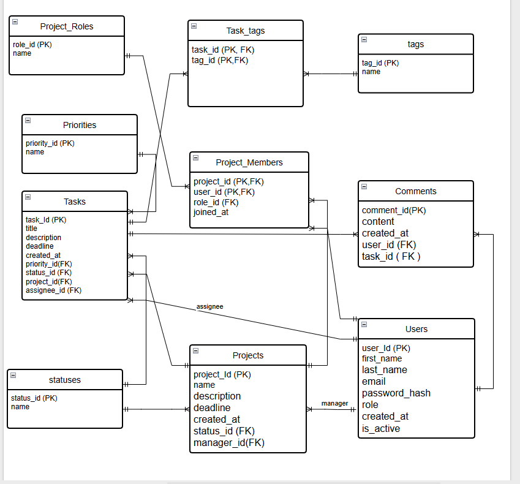

# Лабораторна робота №5
## Нормалізація бази даних
---
### Роботу виконали
Студент групи ІО-46
Орєшин Д.І.
### Роботу перевірив
Русінов В.В.
---
## Мета роботи
* Пошук надлишковості та аномалій: виявлення потенційної надлишковості даних (наприклад, повторювані значення) або аномалій оновлення (проблеми вставки/оновлення/видалення) у поточній схемі.
* Перелік функціональних залежностей: визначте та перелічіть функціональні залежності (ФЗ) для кожної проблемної таблиці.
* Перевірка нормальних форм: оцініть поточну нормальну форму кожної таблиці (1NF, 2NF, 3NF) на основі її функціональних залежностей (ФЗ) та структури ключа.
* Застосування нормалізації: перетворення таблиць у вищі нормальні форми (до 3НФ) для усунення часткових та транзитивних залежностей.
---
## Хід роботи
### Пошук надлишковості та аномалій

Рисунок 1 – Початкова ER-діаграма бази даних

Під час аналізу початкової схеми (Рисунок 1) було виявлено архітектурну надлишковість та ризик виникнення логічних аномалій у зв'язках:

Дублювання зв'язків (Таблиця tasks та task_members): У таблиці tasks існує атрибут assignee_id, який створює прямий зв'язок (1:M) 
між користувачем та завданням. Одночасне існування асоціативної таблиці task_members створює надлишковість.
Це призводить до аномалії оновлення: система може мати одного користувача в assignee_id, але іншого у task_members для одного й того ж завдання.

2. Застосування нормалізації (Перехід до правильної структури)
Щоб усунути надлишковість та нормалізувати зв'язки бази даних, було прийнято рішення:

Видалити таблицю task_members, залишивши прямий зв'язок між users та tasks через assignee_id.

Привести діаграму до концептуального вигляду, відобразивши зв'язки багато-до-багатьох (project <-> user, task <-> tag) 
напряму, без відображення фізичних проміжних таблиць на схемі, щоб уникнути плутанини сутностей та зв'язків.

Текстові атрибути статусів та пріоритетів (VARCHAR) винести в окремі таблиці-довідники для досягнення 3NF.

### Перелік функціональних залежностей
Після аналізу поточної схеми було виявлено такі функціональні залежності для основних сутностей:

Таблиця tasks (Завдання):
task_id → title, description, priority, status, project_id, assignee_id.
status → status_name (Транзитивна залежність: текстове поле статусу визначає категорію стану завдання).
priority → priority_level (Транзитивна залежність: текстове поле пріоритету визначає рівень важливості).

Таблиця projects (Проєкти):
project_id → name, description, status, manager_id.
status → status_name (Транзитивна залежність: стан проєкту не залежить безпосередньо від ID проєкту).

Таблиця project_members (Учасники):
project_id, user_id → role.
role → permissions (Транзитивна залежність: роль учасника визначає набір його прав у системі).
### Перевірка нормальних форм
Початкова схема бази даних відповідає вимогам 2NF (Другої нормальної форми), але має порушення для переходу у 3NF.

1NF (Виконується): Усі атрибути є атомарними, таблиці не містять повторюваних груп або масивів даних.

2NF (Виконується): Усі неключові атрибути повністю залежать від первинних ключів. 
Оскільки більшість таблиць використовує прості сурогатні ключі (SERIAL PRIMARY KEY), часткова залежність від ключа відсутня.

3NF (Порушується): Наявні транзитивні залежності в таблицях tasks, projects та project_members. 
Неключові поля status, priority та role фактично є категоріями, які мають власні властивості та мають бути винесені в окремі таблиці-довідники. 
Також виявлено логічну надлишковість у таблиці task_members, що дублює функціонал поля assignee_id.

### Застосування нормалізації
Для приведення схеми до 3NF (Третьої нормальної форми) та усунення зауважень щодо проектування було проведено наступні кроки:

1. Декомпозиція категорій (Створення таблиць-довідників):
Для усунення транзитивних залежностей та аномалій оновлення було створено три нові таблиці, кожна з яких містить унікальний ідентифікатор та описовий атрибут:

statuses: призначена для централізованого керування станами проєктів та завдань.
status_id (PK) — унікальний сурогатний ключ статусу.
name (Unique) — текстова назва стану (наприклад, 'active', 'completed', 'in_progress').

priorities: використовується для стандартизації рівнів важливості завдань.
priority_id (PK) — унікальний сурогатний ключ пріоритету.
name (Unique) — назва рівня важливості (наприклад, 'low', 'medium', 'high').

project_roles: для чіткого опису функціональних ролей учасників усередині проєктних команд.
role_id (PK) — унікальний сурогатний ключ ролі.
name (Unique) — назва ролі або посади (наприклад, 'Developer', 'Designer', 'QA Engineer').

У головних таблицях (tasks, projects, project_members) відповідні текстові атрибути були видалені та замінені на цілочисельні зовнішні ключі
(status_id, priority_id, role_id), що забезпечує цілісність даних на рівні посилань.

2. Видалення надлишкових зв'язків:
Таблицю task_members було видалено. Прямий зв'язок між користувачем та завданням реалізовано через поле assignee_id у таблиці tasks 
що усуває ризик суперечливих даних про виконавця.
3. Оптимізація асоціативних таблиць:
Для таблиць project_members та task_tags було змінено структуру ключів:
Видалено сурогатний ключ unique_id.
Впроваджено композитний первинний ключ (Composite PK), що складається з пари зовнішніх ключів.
Це забезпечує унікальність зв'язків на рівні ядра БД та відповідає стандартам реляційного моделювання.
### Перероблені SQL-інструкції CREATE TABLE
Нижче наведено команди для трансформації бази даних Task Management System у 3NF.
```sql
-- 1. Створення довідників
CREATE TABLE IF NOT EXISTS statuses (status_id SERIAL PRIMARY KEY, name VARCHAR(32) UNIQUE NOT NULL);
CREATE TABLE IF NOT EXISTS priorities (priority_id SERIAL PRIMARY KEY, name VARCHAR(20) UNIQUE NOT NULL);
CREATE TABLE IF NOT EXISTS project_roles (role_id SERIAL PRIMARY KEY, name VARCHAR(50) UNIQUE NOT NULL);

-- 2. Наповнення довідників унікальними значеннями з існуючих таблиць
INSERT INTO statuses (name) SELECT DISTINCT status FROM tasks;
INSERT INTO statuses (name) SELECT DISTINCT status FROM projects ON CONFLICT DO NOTHING;
INSERT INTO priorities (name) SELECT DISTINCT priority FROM tasks;
INSERT INTO project_roles (name) SELECT DISTINCT role FROM project_members;

-- 3. Модифікація таблиці tasks (додавання FK та видалення старих текстових полів)
ALTER TABLE tasks ADD COLUMN priority_id INTEGER, ADD COLUMN status_id INTEGER;

UPDATE tasks t SET priority_id = p.priority_id FROM priorities p WHERE t.priority = p.name;
UPDATE tasks t SET status_id = s.status_id FROM statuses s WHERE t.status = s.name;

ALTER TABLE tasks 
    DROP COLUMN priority, 
    DROP COLUMN status,
    ALTER COLUMN priority_id SET NOT NULL, 
    ALTER COLUMN status_id SET NOT NULL,
    ADD CONSTRAINT fk_task_priority FOREIGN KEY (priority_id) REFERENCES priorities(priority_id),
    ADD CONSTRAINT fk_task_status FOREIGN KEY (status_id) REFERENCES statuses(status_id);

-- 4. Модифікація таблиці projects (додавання FK)
ALTER TABLE projects ADD COLUMN status_id INTEGER;

UPDATE projects p SET status_id = s.status_id FROM statuses s WHERE p.status = s.name;

ALTER TABLE projects 
    DROP COLUMN status,
    ALTER COLUMN status_id SET NOT NULL,
    ADD CONSTRAINT fk_project_status FOREIGN KEY (status_id) REFERENCES statuses(status_id);

-- 5. Видалення надлишкової таблиці task_members
DROP TABLE IF EXISTS task_members;

-- 6. Модифікація project_members: заміна ролі на FK та впровадження композитного PK
ALTER TABLE project_members ADD COLUMN role_id INTEGER;

UPDATE project_members pm SET role_id = pr.role_id FROM project_roles pr WHERE pm.role = pr.name;

ALTER TABLE project_members 
    DROP CONSTRAINT unique_project_member, 
    DROP COLUMN unique_id, 
    DROP COLUMN role,
    ALTER COLUMN role_id SET NOT NULL,
    ADD PRIMARY KEY (project_id, user_id),
    ADD CONSTRAINT fk_pm_role FOREIGN KEY (role_id) REFERENCES project_roles(role_id);

-- 7. Модифікація task_tags: перехід до композитного PK
ALTER TABLE task_tags 
    DROP CONSTRAINT unique_task_tag, 
    DROP COLUMN unique_id,
    ADD PRIMARY KEY (task_id, tag_id);
```
### ERD після нормалізації

Рисунок 2 – Оновлена нормалізована схема Task Management System
---
## Висновки
У ході лабораторної роботи проведено аналіз схеми бази даних Task Management System, що дозволило виявити архітектурну надлишковість 
та транзитивні функціональні залежності. Через використання текстових полів для категорій та зайвих асоціативних сутностей було встановлено,
що початковий дизайн відповідав лише вимогам 2NF. Для досягнення Третьої нормальної форми (3NF) виконано декомпозицію: створено таблиці-довідники для статусів,
пріоритетів та ролей, а також видалено надлишкову таблицю task_members. Оновлена структура з впровадженням композитних первинних ключів усунула дублювання даних
та мінімізувала ризик виникнення аномалій оновлення. Це забезпечило високу цілісність реляційної моделі, гарантуючи збереження кожного факту лише в одному місці.
Такий підхід спростив управління ролями та категоріями, зробивши систему більш гнучкою для подальшого масштабування.  